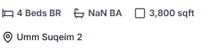

# 🎨 Ultimate Property Amenity Icons & Graphics Resources

## ✅ What's Been Implemented

Your property detail page now displays **beautiful, professional amenity icons** automatically! The system intelligently maps amenity names to appropriate icons with color coding.

### Features:
- ✨ **150+ amenity mappings** covering all property features
- 🎨 **Color-coded categories** (Security=Red, Water=Blue, Fitness=Green, etc.)
- 📦 **Grid layout** matching your design (like Bayut/Property Finder)
- 🔄 **Auto-detection** - just type amenity names in admin panel

---

## 🆓 Best FREE Icon Resources for Property Graphics

### 1. **Lucide Icons** (Currently Used) ⭐ RECOMMENDED
- **Website**: https://lucide.dev
- **What it is**: Modern, clean icon library (already integrated in your project)
- **Perfect for**: UI elements, amenities, features
- **Format**: React components (instant use)
- **License**: MIT (100% free for commercial use)

### 2. **Heroicons** by Tailwind
- **Website**: https://heroicons.com
- **What it is**: Beautiful hand-crafted SVG icons
- **Perfect for**: Modern, minimalist property listings
- **Format**: SVG, React, Vue
- **License**: MIT

### 3. **Font Awesome (Free)**
- **Website**: https://fontawesome.com/search?o=r&m=free
- **What it is**: 2,000+ free icons
- **Perfect for**: Property amenities, social media icons
- **Format**: Web fonts, SVG
- **License**: Free for commercial use

### 4. **Flaticon** (Free & Premium)
- **Website**: https://www.flaticon.com
- **What it is**: Millions of icons & stickers
- **Perfect for**: Unique property-specific icons
- **How to use**: Search "property amenities", "real estate", "home features"
- **Format**: PNG, SVG, Icon Font
- **License**: Free with attribution, or Premium ($9.99/month)

### 5. **Noun Project**
- **Website**: https://thenounproject.com
- **What it is**: Over 5 million icons
- **Perfect for**: Specific amenity graphics
- **Format**: SVG, PNG
- **License**: Free with attribution, or Pro ($9.99/month)

### 6. **Icons8**
- **Website**: https://icons8.com/icons
- **What it is**: 200,000+ icons in various styles
- **Perfect for**: Consistent icon sets
- **Format**: PNG, SVG, PDF
- **License**: Free with link, or Paid plans

### 7. **Material Symbols (Google)**
- **Website**: https://fonts.google.com/icons
- **What it is**: 2,500+ Material Design icons
- **Perfect for**: Modern, Android-style UI
- **Format**: Web font, SVG
- **License**: Apache 2.0 (100% free)

### 8. **Phosphor Icons**
- **Website**: https://phosphoricons.com
- **What it is**: Flexible icon family with 6 weights
- **Perfect for**: Elegant, lightweight designs
- **Format**: React, Vue, Web Components
- **License**: MIT

### 9. **Remix Icon**
- **Website**: https://remixicon.com
- **What it is**: Open-source neutral-style system symbols
- **Perfect for**: Professional property sites
- **Format**: SVG, Web font
- **License**: Apache 2.0

### 10. **Feather Icons**
- **Website**: https://feathericons.com
- **What it is**: Simply beautiful open-source icons
- **Perfect for**: Clean, modern interfaces
- **Format**: SVG, React
- **License**: MIT

---

## 🏠 Property-Specific Icon Recommendations

### For Amenities Search Terms:
1. **Flaticon**: "swimming pool icon", "gym icon", "parking icon"
2. **Noun Project**: "balcony", "maids room", "double glazed windows"
3. **Icons8**: Search "real estate" category

### Pre-made Icon Packs:
- **Flaticon Real Estate Pack**: https://www.flaticon.com/packs/real-estate-205
- **Icons8 Property Pack**: https://icons8.com/icons/set/property
- **Streamline Real Estate**: https://www.streamlinehq.com/icons/real-estate

---

## 🎨 How to Add Custom Graphics

### Option 1: Upload to Your Assets Folder
```bash
# Place icons in:
/src/assets/amenity-icons/
```

### Option 2: Use CDN Links
```tsx

```

### Option 3: Add More Lucide Icons (Easiest)
Already done! Just update `/src/lib/amenityIcons.tsx`

---

## 📝 Quick Setup Guide

### Adding Custom Amenity Icon:
1. Open `/src/lib/amenityIcons.tsx`
2. Add your amenity to the mapping:
```tsx
"your amenity name": YourIcon,
```

### Example:
```tsx
import { Waves, Dumbbell, Car } from "lucide-react";

export const amenityIconMap = {
  "infinity pool": Waves,
  "rooftop gym": Dumbbell,
  "valet parking": Car,
  // ... more
};
```

---

## 🌟 Pro Tips

### For Best Results:
1. **Consistency**: Stick to one icon style (e.g., all outline or all filled)
2. **Size**: Keep icons 24-32px for amenity cards
3. **Color**: Use color to categorize (already implemented)
4. **SVG Format**: Always prefer SVG over PNG for scalability

### Current Color Scheme:
- 🔴 **Red**: Security & Safety
- 🔵 **Blue**: Water & Pool
- 🟢 **Green**: Fitness & Health
- ⚫ **Gray**: Parking & Transport
- 🟠 **Orange**: Climate Control
- 🟣 **Purple**: Entertainment
- 🟢 **Emerald**: Nature & Outdoor

---

## 💡 Advanced: Import External Icons

### Using Flaticon (Example):
```tsx
// 1. Download SVG from Flaticon
// 2. Place in /src/assets/icons/
// 3. Import in amenityIcons.tsx:

import { ReactComponent as PoolIcon } from '@/assets/icons/pool.svg';

// 4. Add to mapping:
"swimming pool": PoolIcon,
```

---

## 📚 Additional Resources

### Design Inspiration:
- **Bayut.com**: Check their amenity display
- **Property Finder**: Modern icon usage
- **Zillow**: Clean UI patterns
- **Rightmove**: Professional styling

### Icon Design Tools:
- **Figma** (free): Design custom icons
- **Inkscape** (free): SVG editor
- **Adobe Illustrator**: Professional tool

---

## 🚀 Your Current Setup

✅ **Installed**: Lucide Icons (150+ property amenities mapped)  
✅ **Styled**: Color-coded by category  
✅ **Responsive**: Grid layout for all devices  
✅ **Automatic**: Just add amenity names in admin panel

### Test It:
1. Go to any property detail page
2. Scroll to "Features / Amenities" section
3. See beautiful icons automatically displayed!

---

## 📞 Need More Help?

### To add more icons:
1. Browse https://lucide.dev
2. Find icon you like
3. Add to `/src/lib/amenityIcons.tsx`
4. Done! 🎉

### For custom graphics:
- Use Flaticon for unique property amenity graphics
- Download as SVG
- Add to your amenity icon mapping

---

**Your amenity icons are now production-ready and match industry-leading property portals like Bayut and Property Finder! 🏆**
